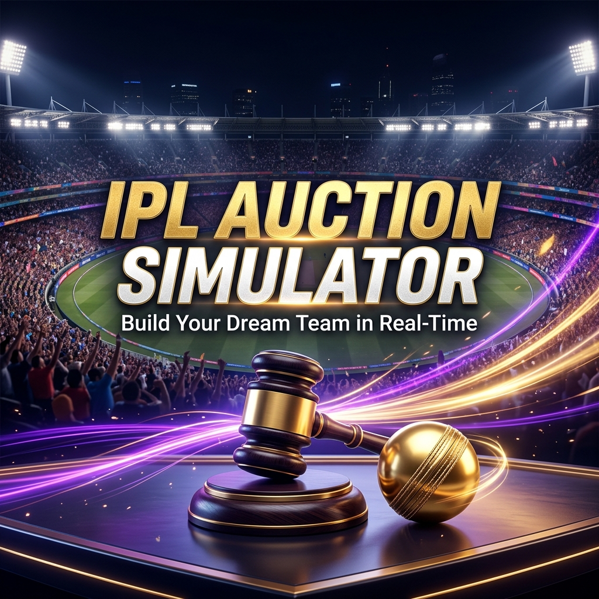

# 🏏 IPL Auction Simulator

[](https://ipl-auction-umber.vercel.app/)
[](https://ipl-auction-oogk.onrender.com/)

An immersive, real-time, multiplayer **IPL Auction Experience** built for cricket fans. Build your dream franchise, manage your budget, and outbid your friends (and AI bots) in a high-stakes drafting room.



## 🚀 Features

- **⚡ Real-time Bidding**: Powered by Socket.io for instantaneous bid updates across all participants.
- **🤖 Smart AI Bots**: Don't have enough friends? Enable AI franchises that bid strategically based on player value and squad needs.
- **🎭 Cinematic UI**: Modern glassmorphism design with rhythmic animations and dramatic player intro modals.
- **👑 Admin Controls**: Pause, resume, and skip players. Toggle between AI and vacant teams mid-auction.
- **📊 Advanced Analytics**: Real-time budget tracking, overseas count limits, and post-auction squad summaries.

## 🛠️ Tech Stack

- **Frontend**: React.js, Vite, Axios, Lucide Icons, Framer Motion.
- **Backend**: Node.js, Express, Socket.io.
- **Database**: MongoDB Atlas.
- **Hosting**: Vercel (Frontend) & Render (Backend).

## 🚦 Quick Start

### 1. Clone the repository
```bash
git clone https://github.com/bhaveshsharmaaa/ipl-auction.git
```

### 2. Install Dependencies
```bash
# Install Server dependencies
cd server
npm install

# Install Client dependencies
cd ../client
npm install
```

### 3. Setup Environment Variables
Create a `.env` file in the `server` directory:
```env
MONGODB_URI=your_mongodb_uri
JWT_SECRET=your_secret_key
PORT=5000
CLIENT_URL=http://localhost:5173
```

### 4. Run Locally
```bash
# Start Backend (from /server)
npm run dev

# Start Frontend (from /client)
npm run dev
```

## 📸 Screenshots

| Draft Room | Team Selection |
| :--- | :--- |
|  | High-stakes bidding with real-time stats |

---

> [!TIP]
> **SEO Ready**: This project is fully optimized with a sitemap, robots.txt, and meta tags to rank for "IPL Auction Game" searches!

## 📄 License
Internal Project - All Rights Reserved.

---
Built with ❤️ by [Bhavesh Sharma](https://github.com/bhaveshsharmaaa)
